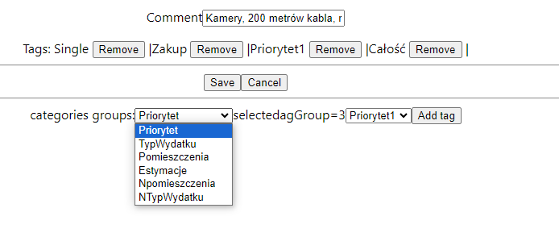

### TagGroupCategory

I need it as when adding tags I should now what kind of tags are defined for this category.
On the edit expense page I need to know what categories I should display for given category 
```
select * from me.TagGroup where TagGroupID=4
select * from me.Tag where TagGroupID=4
select * from me.tagGroupCategory
select * from me.Category where name like 'Setup'
```

